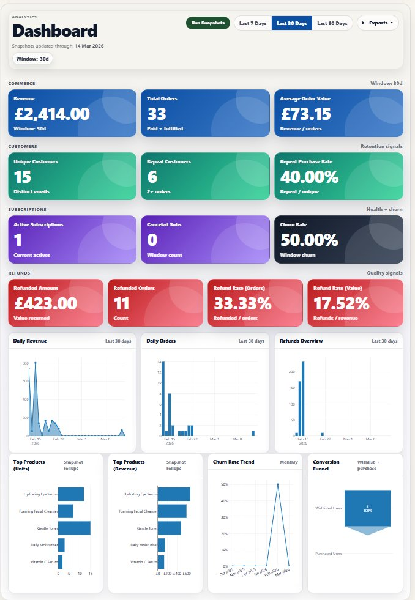
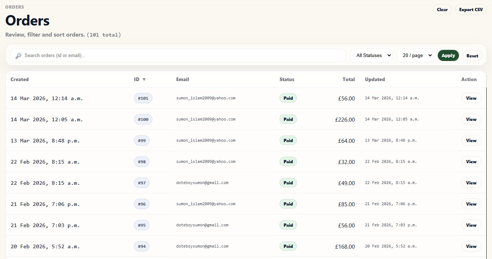
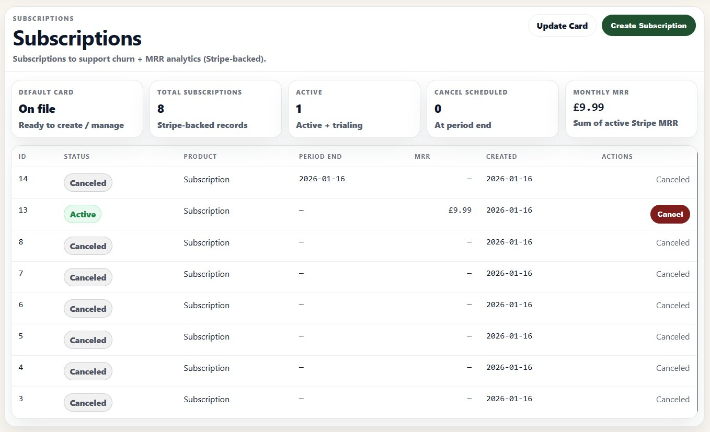
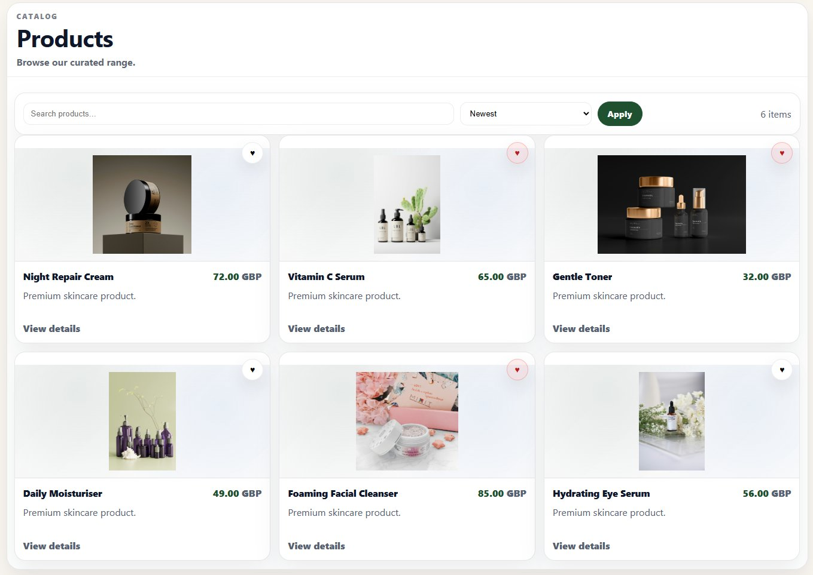

<div align="center">



<br/>
<br/>

# PureLaka Commerce Platform

**Transactional commerce data → KPI dashboards → operational insight**

<br/>

[](https://www.python.org/)
[](https://www.djangoproject.com/)
[](https://stripe.com/docs/payments/payment-intents)
[](https://plotly.com/python/)
[](https://www.postgresql.org/)

<br/>

> **Best role fit:&ensp;** `Analytics Engineer` &ensp;·&ensp; `Data Analyst` &ensp;·&ensp; `BI / Reporting Analyst` &ensp;·&ensp; `Data Engineer — Integration` &ensp;·&ensp; `Python / Django Data-Product Roles`

</div>

---

## The Business Problem This Solves

Commerce teams generate enormous volumes of transactional data — orders, payments, refunds, subscriptions — and routinely struggle to turn it into timely, trustworthy operational insight.

**PureLaka is built to close that gap.**

It functions as a commerce analytics and reporting product: a structured system that transforms raw transactional records into KPI dashboards, monitored data pipelines, and business-facing reporting surfaces — with the reliability and auditability that operational teams depend on.

This is not a storefront demo. It is not a Stripe integration walkthrough. It is a **transactional data product** engineered for the full lifecycle: capture → quality → reporting → insight.

---

## What It Delivers

| Business Output | How It's Delivered |
|---|---|
| **Revenue & order reporting** | KPI dashboard with date-range filters, snapshot windows, and CSV export |
| **Payment visibility** | PaymentIntent lifecycle tracking with refund handling and state reconciliation |
| **Subscription health** | MRR tracking, churn-related metrics, and subscription lifecycle state management |
| **Data trust** | Operational monitoring with mismatch detection and on-demand quality checks |
| **Audit accountability** | Event-level logging across order transitions, payments, and refunds |
| **Role-appropriate access** | Scoped views for Admin, Analyst, and Ops — the right data to the right person |

---

## Screenshots

| | |
|---|---|
|  |  |
| **`01 · Analytics`** &nbsp; Commerce Analytics Dashboard<br/><sub>`KPI reporting` &nbsp; `Plotly charts` &nbsp; `CSV export` &nbsp; `Snapshot windows`</sub> | **`02 · Monitoring`** &nbsp; Data Quality Monitoring<br/><sub>`Mismatch detection` &nbsp; `Stock checks` &nbsp; `Audit trail` &nbsp; `Run checks`</sub> |
|  |  |
| **`03 · Orders`** &nbsp; Orders List / Reporting View<br/><sub>`Search` &nbsp; `Filter` &nbsp; `Export CSV` &nbsp; `Staff view`</sub> | **`04 · Transactions`** &nbsp; Order Detail / Payment / Refund / Audit<br/><sub>`PaymentIntent` &nbsp; `Refund flow` &nbsp; `Audit log`</sub> |
|  |  |
| **`05 · Subscriptions`** &nbsp; Subscriptions / MRR Dashboard<br/><sub>`MRR` &nbsp; `Churn metrics` &nbsp; `Lifecycle states` &nbsp; `Stripe-backed`</sub> | **`06 · Payments`** &nbsp; Secure Checkout<br/><sub>`Stripe-ready` &nbsp; `PaymentIntent` &nbsp; `Webhook confirmed` &nbsp; `Mock mode`</sub> |
|  | |
| **`07 · Catalogue`** &nbsp; Products Catalog<br/><sub>`Variants` &nbsp; `Categories` &nbsp; `Wishlist` &nbsp; `Product images`</sub> | |

---

## Tech Stack — Deep Dive

PureLaka is built on a production-aligned Python/Django stack. Every technology choice reflects how this class of system is built in professional analytics and data-product environments — not convenience defaults, but deliberate selections made for specific reasons.

---

### Core Framework

| Technology | Version | Why It's Here |
|---|---|---|
| **Python** | 3.12 | Industry-standard for analytics and data-product engineering. Strong ORM ergonomics, mature service-layer patterns, and a rich ecosystem for data handling and reporting. |
| **Django** | 5.x | Battle-tested MVC framework with a first-class ORM, built-in admin surface, and clean separation between data access, business logic, and presentation. Chosen over lighter frameworks because the project's scope — multi-domain data modelling, role-based access, admin tooling — rewards Django's depth. |
| **PostgreSQL** | Production-ready target database | Production-grade relational store optimised for transactional integrity and analytical query patterns. SQLite is used for local development to reduce setup friction; the schema is PostgreSQL-first in design. |

---

### Payments Layer

| Technology | Role |
|---|---|
| **Stripe PaymentIntents API** | Manages the full payment lifecycle — authorisation, capture, cancellation, and refund — using Stripe's idempotent, state-machine-oriented API. Chosen because PaymentIntents is the current Stripe standard for complex payment flows and maps cleanly to the order-payment state model used throughout the system. |
| **Webhook-aware handling layer** | Receives and processes Stripe event callbacks to keep local payment state in sync with Stripe's source of truth. Critical for mismatch detection in the monitoring layer. |
| **Mock mode** | Decouples local development from live credentials. All payment flows are fully exercisable without a Stripe account, enabling frictionless review and testing. |

> The PaymentIntent pattern was chosen deliberately. It mirrors how production commerce systems manage payment state, and it is the architectural decision that makes payment/order mismatch detection — one of PureLaka's core monitoring capabilities — both meaningful and reliable.

---

### Analytics & Visualisation

| Technology | Role |
|---|---|
| **Plotly (Python)** | Server-side chart generation for the KPI dashboard. Chosen for its strong support of business chart types (time series, bar, funnel, waterfall), clean rendering behaviour, and export compatibility. Avoids the JavaScript complexity of client-side charting libraries for a server-rendered Django context. |
| **Snapshot analytics services** | A custom service layer that aggregates transactional data into reporting snapshots on demand. Deliberately decoupled from the write path to avoid query contention and to allow the reporting layer to evolve independently of the transactional schema. |
| **CSV export** | Native Python `csv` module. Available on key reporting surfaces for analyst handoff and downstream compatibility with Excel, BI tools, and data pipelines. No third-party dependency; no formatting overhead. |

---

### Data Quality & Audit

| Technology | Role |
|---|---|
| **Monitoring app** | A custom Django app providing a run-on-demand operational check surface. Checks include payment/order mismatches, invalid state transitions, and negative stock conditions. Designed so new checks can be added as discrete, independently runnable units — reflecting how operational data quality is managed in production analytics teams. |
| **Audit app** | Discrete audit event records written at key action points. Implemented as explicit writes rather than model signals — a deliberate choice that makes the audit trail durable across schema refactors and independently queryable as a reporting surface. |

---

### Access Control

Role-based access is implemented via Django's authentication system, extended with custom view decorators. Three operational personas are supported:

| Persona | Access Scope |
|---|---|
| **Admin** | Full system access — all surfaces, all data, monitoring controls |
| **Analyst** | Analytics dashboard, reporting surfaces, CSV export, subscription metrics |
| **Ops** | Orders, order detail, payment and refund workflows, audit log |

Each persona sees exactly the surfaces relevant to their function — reflecting how access is scoped in real analytics and operations environments.

---

## Architecture

PureLaka follows a **multi-app Django structure** with clear domain ownership. The analytics and monitoring layers are designed as read-oriented consumers of the transactional core, kept separate from transactional workflows.

```text
purelaka-commerce-platform/
│
├── products/          # Product catalogue, variants, and category management
├── cart/              # Session cart and checkout workflow
├── orders/            # Order lifecycle state management
├── payments/          # PaymentIntent services, refund flows, webhook handling
├── subscriptions/     # Subscription lifecycle logic and MRR analytics inputs
│
├── analyticsapp/      # KPI dashboard, snapshot services, and reporting surfaces
├── monitoring/        # Operational checks, mismatch detection, issue visibility
├── audit/             # Event logging and audit-oriented support services
│
├── accounts/          # Account, profile, and address management
├── wishlist/          # Wishlist workflow and user interactions
│
└── docs/              # Summary documentation and private review materials
```

---

## Feature Set

<details>
<summary><b>Commerce Workflow</b></summary>
<br/>

- Product catalogue with variants, categories, and image handling
- Session-based cart and checkout flow
- Order lifecycle state management (pending → confirmed → fulfilled → canceled)
- Wishlist functionality per customer account
- Customer account area with address management

</details>

<details>
<summary><b>Payments & Subscriptions</b></summary>
<br/>

- Stripe-ready payment flow using the PaymentIntent pattern
- Optional mock mode for local development without live Stripe credentials
- Refund service with state tracking and audit coverage
- Subscription workflow with MRR-oriented analytics inputs
- Churn-related metrics surfaced in the Subscriptions dashboard

</details>

<details>
<summary><b>Analytics & Reporting</b></summary>
<br/>

- KPI dashboard with Plotly-based chart outputs
- Date-range filters for common reporting windows (7d / 30d / 90d / custom)
- CSV export available on key reporting surfaces
- Product, order, customer, and revenue summary views
- Snapshot-oriented analytics services, decoupled from transactional writes

</details>

<details>
<summary><b>Monitoring & Controls</b></summary>
<br/>

- Operational data quality monitoring surface
- Payment/order mismatch detection with run-on-demand checks
- Invalid order-state and negative stock checks
- Audit trail coverage for payments, refunds, and order transitions
- Role-based access: Admin, Analyst, and Ops view scoping

</details>

---

## Reviewer Guide

For the fastest and most representative review of PureLaka's capabilities:

| Step | Surface | What to Assess |
|---|---|---|
| **1** | Analytics Dashboard | Reporting scope, chart outputs, date-range filters, CSV export |
| **2** | Monitoring Surface | Mismatch detection design, data quality check logic, issue visibility |
| **3** | Orders + Order Detail | Order lifecycle states, payment state tracking, audit log coverage |
| **4** | Subscriptions / MRR | MRR tracking, churn metrics, lifecycle state handling |
| **5** | Architecture + screenshots | Assess reporting/service separation and read-oriented design |
| **6** | Private technical walkthrough | Source review and implementation details available on request |

---

## Portfolio Context

PureLaka is one of **three intentionally scoped portfolio projects**, each demonstrating a distinct category of data engineering and analytics work:

| Project | Data Category | Core Focus |
|---|---|---|
| **CineScope Analytics** | Event / activity data | User behaviour, event pipelines, activity analytics |
| **DataBridge Market API** | External / API-driven data | Multi-source integration, API design, data serving |
| **PureLaka Commerce Platform** | Transactional business data | Orders, payments, subscriptions, KPI reporting |

Together they demonstrate **breadth across event-oriented, external, and transactional data** — each with its own architecture, proof structure, and role alignment.

---

<br/>

<div align="center">

## 🔒 &ensp; Private Technical Review

### This project is available for deeper engagement.

Full source code, a structured architecture walkthrough, and direct technical discussion  
are available for the right conversations.

<br/>

**Mentors** &ensp;·&ensp; **Recruiters** &ensp;·&ensp; **Hiring managers** &ensp;·&ensp; **Technical interview discussions**

<br/>

If you would like access to the complete source or a guided walkthrough  
of the architecture and key design decisions, reach out directly.

<br/>

### 📩 &ensp; [Request private review access](aminulislamkhan.tech@gmail.com)

<br/>

</div>

---

<div align="center">
<sub>Built with Python · Django · Stripe · Plotly · PostgreSQL</sub>
</div>
